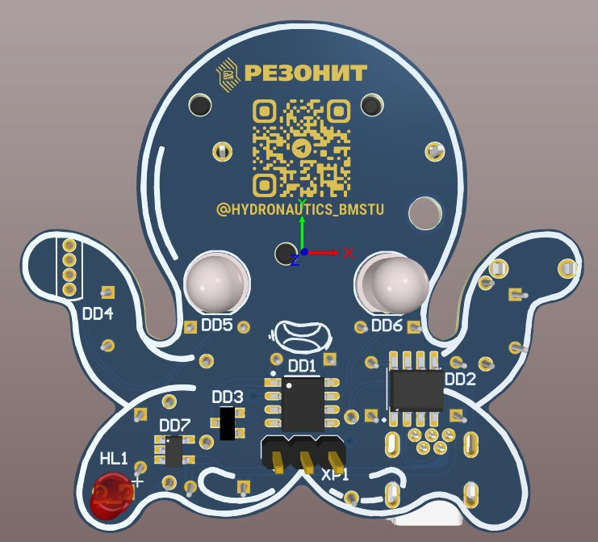
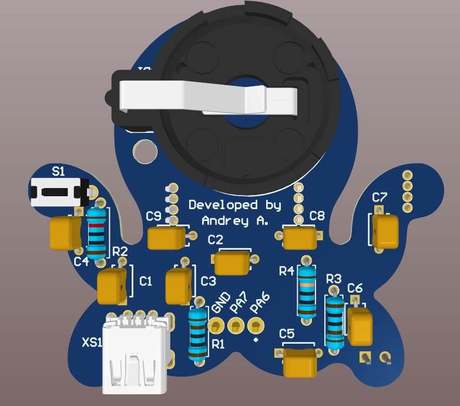

# 🐙 Octopus_2.0

**Печатная плата-брелок в форме осьминога**  
Разработана для обучения пайке и программированию микроконтроллеров

---

## 📌 О проекте

**Octopus_2.0** — это учебная печатная плата, выполненная в формате брелока с дизайном осьминога.  
Проект создан специально для **мастер-классов по пайке и программированию** среди первокурсников и начинающих инженеров.

---

## 🎯 Цель разработки

- Познакомить начинающих с основами электроники и пайки
- Научить программировать микроконтроллеры на практическом примере
- Сформировать навыки работы с **Arduino IDE** и низкоуровневым программированием

---

## 🧩 Технические характеристики

| Параметр | Описание |
|----------|----------|
| **Микроконтроллер** | Attiny412 (8-битный, AVR) |
| **Светодиоды** | 3 программируемых адресных светодиода WS2812B |

---

## 💡 Возможности

- Управление тремя RGB-светодиодами **WS2812B** (каждый адресуется индивидуально)
- Программирование через **USB Mini** (без внешнего программатора)
- Подключение внешних компонентов к свободным ногам МК
- Использование готового драйвера для светодиодов
- Поддержка **VScode** в паре с **avr-gcc** и **avrdude**
- Поддержка **Arduino IDE** (отдельная ветка для упрощённой работы)

---

## 🧠 Программное обеспечение

- **Основной драйвер** для работы со светодиодами и низкоуровневое программирование:  
  👉 [Octopus_soft](https://github.com/klegot/Octopus_soft.git)

- **Версия для Arduino IDE**:  
  👉 [Octopus_soft/arduino_ide](https://github.com/klegot/Octopus_soft/tree/arduino_ide)

---

## 📷 Внешний вид

| Вид сверху | Вид снизу |
|:---:|:---:|
|  |  |

---

## 👨‍🔧 Автор

**Абрамов Андрей**
УНМЦ «Гидронавтика»